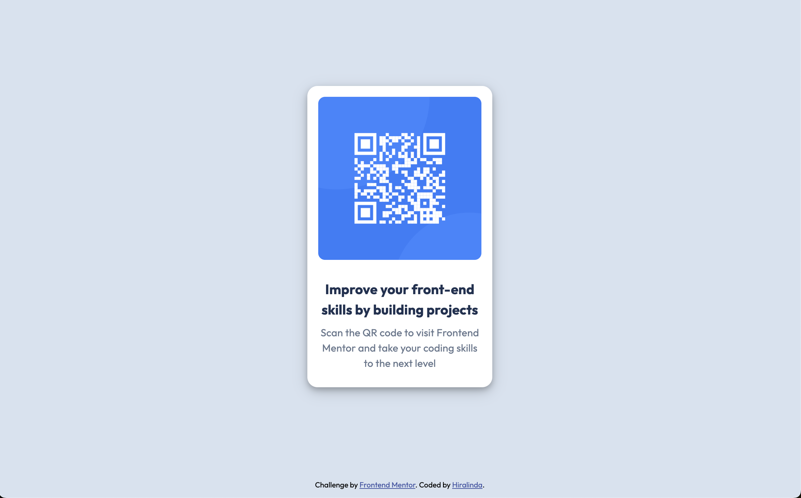
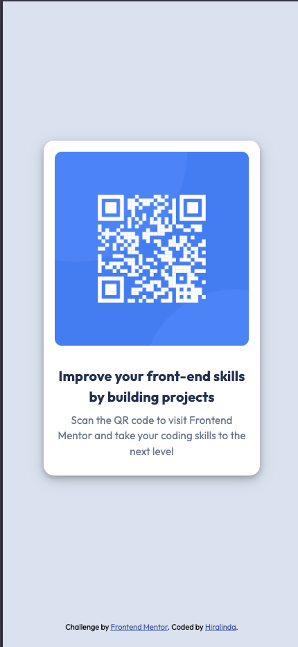

# Frontend Mentor - QR code component solution

This is my solution to the [QR code component challenge on Frontend Mentor](https://www.frontendmentor.io/challenges/qr-code-component-iux_sIO_H) made with React and MUI

## Table of contents

- [Overview](#overview)
  - [Screenshot](#screenshot)
- [My process](#my-process)
  - [Built with](#built-with)
  - [What I learned](#what-i-learned)
  - [Continued development](#continued-development)
  - [Useful resources](#useful-resources)
- [Author](#author)
- [Acknowledgments](#acknowledgments)

## Overview

This project is a simple, responsive QR code component built as a solution to the [QR code component challenge on Frontend Mentor](https://www.frontendmentor.io/challenges/qr-code-component-iux_sIO_H). It showcases a clean, centered design featuring a QR code image and descriptive text, demonstrating skills in HTML, CSS, and responsive web design.

### Screenshot

## My process

### Built with

- Semantic HTML5 markup
- CSS custom properties
- Mobile-first workflow
- [React](https://reactjs.org/) - JS library
- [Material-UI](https://mui.com/) - React UI library

### What I learned

This project helped reinforce my understanding of:
- Creating responsive layouts using Material-UI's `Stack` component
- Implementing custom styles within the Material-UI framework
- Handling different screen sizes with responsive design techniques

### Continued development

In future projects, I'd like to focus on:
- Developing with less need of tutorial videos
- Improving accessibility features
- Exploring more advanced Material-UI components

### Useful resources

- [React Learner YouTube Channel](https://www.youtube.com/@ReactLearnerWeb): This channel provided excellent tutorials on React and Material-UI implementation. Their step-by-step explanations were particularly helpful in understanding how to structure components and apply responsive designs.

- [Material-UI Documentation](https://mui.com/material-ui/getting-started/): The official Material-UI documentation was invaluable for understanding the proper usage of components like Stack and Typography, as well as how to customize them to fit the design requirements.

## Author

- Frontend Mentor - [@hiralinda](https://www.frontendmentor.io/profile/hiralinda)

## Acknowledgments

Thanks to Frontend Mentor for providing this challenge and to the online developer community for their invaluable resources and support.